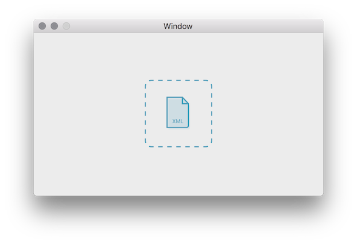

## Drag and Drop on macOS with Swift 3

A simple Cocoa app accepts .xml files and print the paths. NSImageView image method was created by [PaintCode](https://www.paintcodeapp.com).

I have rewrote from the base following the [article](https://www.appcoda.com/macos-image-uploader-app/). For more details, please visit the [website](https://www.appcoda.com/)

Screen shot: 
